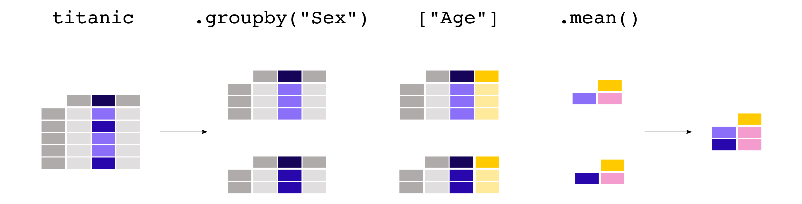

# 02/06

# 오늘 할 일
1. Pandas 공식 문서 탐독
2. 어제 학습한 Numpy, Pytorch 내용 다시 정리 
3. 선형대수 내용 다시 정리하기 
---
# 강의 노트 
# Pandas
- `Pandas is a fast, powerful, flexible and easy to use open source data analysis and manipulation tool,
built on top of the Python programming language.`
- 데이터 분석과 조작을 위한 파이썬 라이브러리 

## 공식 문서 Basic

1. 판다스가 다루는 데이터 종류
   - 표 형식의 데이터를 다룸, key-value의 구성
   - 이를 Pandas에서는 dataframe라고 한다. 
   - col명 => key, row의 data => value
   - 데이터 프레임의 일부분을 Series라고 한다.
   - 데이터프레임은 행렬이라고 하면 시리즈는 컬럼 벡터라고 할 수 있다. 

2. 테이블 데이터를 읽고 쓰는 방법은?
   - read_*() 메서드를 통해 읽고
   - to_*() 메서드를 통해 쓰고 저장할 수 있다.

3. 테이블의 특정 부분을 선택하는 방법은?
    - 테이블에서 하나의 컬럼은 기본적으로 Series이다. 하지만, dataframe으로도 추출가능하다.
    - 테이블의 멀티 컬럼인 subset은 테이블이다. 
    - loc, iloc, filter, slicing 등의 방법으로 선택가능하다.
    - 여기서 loc와 iloc 인덱스를 선태하는 메서드이며 => [row, col]을 기준으로 한다. 
    ```python
    # loc
    adult_names = titanic.loc[titanic["Age"] > 35, "Name"]
    # iloc
    titanic.iloc[9:25, 2:5]
    ```
    - loc 또는 iloc을 사용하여 선택한 데이터에 새로운 값을 할당할 수도 있습니다.

4. 데이터를 시각화를 하는 방법은?
    - .plot.* 메서드는 Series와 DataFrame 모두에서 사용할 수 있습니다.
    - 기본적으로 각 열(column) 은 서로 다른 요소(선 그래프, 박스플롯 등)로 표시됩니다.
    - pandas를 사용하여 생성된 모든 그래프는 Matplotlib 객체입니다.

5. 기존 컬럼을 활용하여 새로운 칼럼을 만드는 방법은?
    - 새로운 열(column)을 생성하려면 대괄호 [] 안에 새로운 열 이름을 지정한 후 값을 할당하면 됩니다.
    - 연산은 원소 단위(element-wise) 로 수행되므로, 행을 반복(iterate)할 필요가 없습니다. -> numpy와 유사
    - 행 레이블(row label) 또는 열 이름(column name)을 변경하려면 딕셔너리 또는 함수를 rename 메서드와 함께 사용하면 됩니다.
    ```python
    air_quality_renamed = air_quality.rename(
    columns={
        "station_antwerp": "BETR801",
        "station_paris": "FR04014",
        "station_london": "London Westminster",
        }
    )
    ```

6. 데이터의 요약 통계를 계산하는 방법은?
    - 집계 통계(aggregation statistics)는 전체 열(column) 또는 행(row) 에 대해 계산할 수 있습니다.
    - groupby는 split-apply-combine 패턴을 구현할 수 있는 강력한 기능을 제공합니다.
    
    - value_counts는 변수의 각 범주(category)에 속하는 항목 수를 빠르게 계산하는 편리한 방법입니다.

7. 테이블 구조를 변형하는 방법은?
    - sort_values 를 사용하면 하나 또는 여러 개의 열을 기준으로 정렬할 수 있습니다.
	- pivot 함수는 데이터를 단순히 재구조화하는 기능을 하며, pivot_table 은 집계를 지원합니다.
	- pivot의 반대 연산(넓은 형식 → 긴 형식)은 melt 입니다. (melt: 넓은 형식에서 긴 형식으로 변환)

8. 여러 테이블을 합치는 방법은?
    - 여러 개의 테이블을 열(column) 기준 또는 행(row) 기준으로 연결(concatenation) 하려면 concat 함수를 사용할 수 있습니다.
	- 데이터베이스 스타일의 병합(merging) 또는 조인(joining) 을 수행하려면 merge 함수를 사용합니다.

9.  시계열 데이터 처리를 하는 방법은?
    - 유효한 날짜 문자열은 to_datetime 함수 또는 데이터 읽기 함수(read_csv 등)의 일부 옵션으로 datetime 객체로 변환할 수 있습니다.
	- pandas의 datetime 객체는 연산, 논리 연산, 날짜 관련 속성을 제공하며, 이를 dt 접근자를 통해 사용할 수 있습니다.
	- DatetimeIndex 는 이러한 날짜 관련 속성을 포함하며, 편리한 슬라이싱(slicing)을 지원합니다.
	- resample 은 시간 시리즈의 빈도를 변경하는 강력한 기능을 제공합니다.

10. 텍스트 데이터를 다루는 방법은? 
    - 문자열 관련 메서드는 str 접근자를 사용하여 사용할 수 있습니다.
	- 문자열 메서드는 원소 단위(element-wise)로 동작하며, 조건 기반 인덱싱에도 활용할 수 있습니다.
	- replace 메서드는 딕셔너리를 이용하여 특정 값을 간편하게 변환할 수 있는 편리한 방법입니다.

## Categorical data
  - 데이터 종류 
    - 범주형데이터 vs 수치형데이터
    - 이는 명목형과 순서형 카테고리가 있다.
    - 해당 데이터는 카테고리 혹은 nan값이다. 
    ```python
    df = pd.DataFrame({"value": np.random.randint(0, 100, 20)})
    labels = ["{0} - {1}".format(i, i + 9) for i in range(0, 100, 10)]
    df["group"] = pd.cut(df.value, range(0, 105, 10), right=False, labels=labels)
    df.head(10)
    >>  value  group
    0     65  60 - 69
    1     49  40 - 49
    2     56  50 - 59
    3     43  40 - 49
    4     43  40 - 49
    5     91  90 - 99
    6     32  30 - 39
    7     87  80 - 89
    8     36  30 - 39
    9      8    0 - 9
    # pd.cut을 통해 bin을 생성해주고 bin하나 하나를 카테고리로 한 데이터 프레임을 생성해주었다. 
    ```

## DataFrame
```python
class pandas.DataFrame(data=None, index=None, columns=None, dtype=None, copy=None)
```
- 라이브러리의 소스코드를 보는 것은 매우 유용하다. 
- 이를 이해하는 것이 파이썬에 대한 깊은 이해를 나타낸다. 

### Arguement에 대한 이해
- arguement이란?
  - 함수나 메서드를 호출할 때 전달하는 값
  - patameter는 변수 / argument는 실제 값 
    - 위치 인자
      - 순서대로 전달하는 인자
    - 키워드 인자
      - 인자의 이름을 지정하여 전달
      - 함수 호출 시 인자의 순서와 관계없이 원하는 매개변수에 값을 할당할 수 있게 됨.
- keyword argument
  - key = value 구조로 argument을 줄 수 있다. 
- *arg, **kwargs
  - 파이썬에서 가변적인 수의 인자를 전달할 수 있게 해줌 
  - 1. *args(positional argument)
    - 순서대로 전달된 인자들을 튜플(tuple)로 묶어 처리
    - 여러 개의 값을 한 번에 처리할때 주로 사용
    ```python
    def my_function(*args):
        for arg in args:
            print(arg)
    my_function(1, 2, 3)  
    >> 1 2 3
    ```
  - 2. **kwargs(keyword argument)
    - 키-값 쌍으로 전달된 인자들을 딕셔너리(dict)로 묶어 처리
    - 옵션 설정 이나 초기화할 때 키워드 인자를 처리할 때 사용
    ```python
        def my_function(**kwargs):
        for key, value in kwargs.items():
            print(f"{key}: {value}")
        my_function(name="Alice", age=30)  
        >> name: Alice, age: 30
    ```
  - 3. 같이 사용되는 경우도 많은데 
    ```python
        def my_function(*args, **kwargs):
            print("Positional arguments:", args)
            print("Keyword arguments:", kwargs)

        my_function(1, 2, 3, name="Alice", age=30)
        >>  Positional arguments: (1, 2, 3)
            Keyword arguments: {'name': 'Alice', 'age': 30}
    ```
    - 이때 *args가 먼저나오고 그다음에 **kwargs가 나와야한다. 
    - 


## Numpy와 Pandas의 축 개념 
- numpy.max
    ```python
    DataFrame.sum(axis=0, skipna=True, numeric_only=False, min_count=0, **kwargs)
    ```
    - along which -> 그 축 방향을 따라간다. 
    - 2차원에서 
      - 축 0 : 위에서 아래
      - 축 1 : 왼쪽에서 오른쪽 
    ```python 
    import numpy as np
    a = np.arange(4).reshape((2,2))
    print(a)
    >> [[0 1]
        [2 3]]
    print(np.max(a))
    >>  3          # Maximum of the flattened array
    # 1차원 배열에서는 스칼라 값을 출력하지만
    # 하지만 axis 매개변수를 사용하면 
    # axis 매개변수를 지정하면, 해당 축을 따라 최대값을 계산하기때문에 
    # 결과는 배열 형태로 반환됨.
    print(np.max(a, axis=0))
    >> [2, 3] # Maxima along the first axis
    print(np.max(a, axis=1))   
    >> [1,3] # Maxima along the second axis
    print(np.max(a, where=[False, True], initial=-1, axis=0))
    >> [-1, 3]
    b = np.arange(5, dtype=float)
    b[2] = np.nan
    # 결측치가 있을때는 다르게 처리를 해야한다.
    print(np.max(b))
    >> nan    
    print(np.max(b, where=~np.isnan(b), initial=-1))
    >> 4.0
    print(np.nanmax(b))
    >> 4.0
    ```

---
# 개인 학습
## Pytorch 리뷰
### Pytorch indexing
- numpy indexing과 어의 유사 
- pytorch의 indexing 기본
    ```python
    import torch
    # 행렬에 대한 인덱싱과 슬라이싱
    A = torch.tensor([[1,2,3],[4,5,6],[7,8,9]]) # []가 하나의 행
    print(A[0]) # 하나만 쓰면 행에 대한 인덱싱 (리스트 속 리스트 생각)
    print(A[-1])
    print(A[1:])
    print(A[:])
    print(A[0][2])
    print(A[0,2]) # 2차원 행렬도 동일한데, 리스트와 달리 이런 것도 됨
    B = [[1,2,3,4],[5,6,7,8]]
    print(B[0][2])
    # print(B[0,2]) # errol
    print(A[1,:1])# 1 행, 전부
    print(A[1,0:3:2])
    print(A[:, 2]) # 행 전부, 2번째 열
    print(A[:][2]) # A[0][2]와 다름. 처음부터 끝까지 인덱싱 why 행 전부 -> 여기서 두번째 행 
    >> tensor([1, 2, 3])
    >> tensor([7, 8, 9])
    >> tensor([[4, 5, 6],
            [7, 8, 9]])
    >> tensor([[1, 2, 3],
            [4, 5, 6],
            [7, 8, 9]])
    >> tensor(3)
    >> tensor(3)
    >> 3
    >> tensor([4])
    >> tensor([4, 6])
    >> tensor([3, 6, 9])
    >> tensor([7, 8, 9])
    ```
  
    ```python
    array = np.arange(0,24).reshape((2,3,4))
    print(array)
    A = torch.tensor(array)
    print(A)
    print(A.shape)
    print(A[0,1,2])

    a = torch.tensor([1,2,3,4]) 
    print(a.shape)
    a = torch.tensor([[[1,2,3,4]]]) 
    print(a.shape) # 대괄호가 하나 늘어나면 왼쪽에 shape값이 추가된다.
    # 위와는 다르게 하나의 뭉탱이로 존재함. 1차원 행렬이 아님. 2차원 행렬임
    >>tensor([[[ 0,  1,  2,  3],
            [ 4,  5,  6,  7],
            [ 8,  9, 10, 11]],

            [[12, 13, 14, 15],
            [16, 17, 18, 19],
            [20, 21, 22, 23]]])
    >>torch.Size([2, 3, 4])
    >>tensor(6)
    >>torch.Size([4])
    >>torch.Size([1, 1, 4])
    ```
- indexing 고급
    ```python
    print(A[[0,1,1,0],[0,1,2,1],[3,3,2,1]])
    >> tensor([ 3, 19, 22,  5])
    ```
    - 리스트로 인덱싱하는 방법으로 각 리스트의 동일 index상의 값들을 가져와 indexing하는 방법이다. 
    ```python
    # boolean 인덱싱
    a=[1,2,3,4,5,3,3]
    print(a==3) # 여러개 값 들어있는 리스트랑 3 달랑 하나랑 같냐? 다르다!
    A=torch.tensor([[1,2,3,4], [5,3,7,3]])
    print(A>3) # 리스트와 달리 각 성분에 대해 비교해 줌
    print(A[A>3]) # True, False가 담긴 행렬로 인덱싱 가능!!
    A[A>3] = 100
    print(A) # 그러면 이런 것도 가능하다! (3보다 큰 애들을 100으로 바꿔줘)
    A=torch.tensor([[1,2], [3,4], [5,6], [7,8]])
    B=torch.tensor([True, False, False, True])#행만 boo1로 인덱싱 하는 것도 가능
    print(A[B,:]) # 0행, 3행 슬라이싱
    b=torch.tensor([1,2,3,4])
    print(b[[True,True,False,False]])# 참고로 그냥 리스트여도 됨
    c=[1,2,3,4]
    # c[[True True,False,Falsel]] # error
    False
    >>tensor([[False, False, False,  True],
    >>        [ True, False,  True, False]])
    >>tensor([4, 5, 7])
    >>tensor([[  1,   2,   3, 100],
    >>        [100,   3, 100,   3]])
    >>tensor([[1, 2],
    >>        [7, 8]])
    >>tensor([1, 2])

    # tensor로 인덱싱
    a=torch.tensor([1,2,3,4,5])
    A=a[2]
    print(A)
    A=a[torch.tensor(2)]
    # torch.tensor를 안에다가?
    print(A)
    A=a[torch.tensor([2,3,4])]
    print(A)
    A=a[torch.tensor([[2,2,2], [3,3,3]])]
    print(A)
    # 인덱싱된 애들로 2행 3열짜리 행렬을 만든다
    a=[1,2,3]
    # a[[1,1,1,1,2,2,2]] #error!
    a=torch.tensor([[1,2,3], [4,5,6]])
    print(a[torch.tensor(0)]) # 0번째 뭉탱이를 가져온다.
    A=a[torch.tensor([[0,1],[1,1]])]
    # 0에는 첫번째 뭉탱이[1,2,3] 그리고 1에는 두번째 뭉탱이 [4,5,6]이 들어간다.
    # 최소의 []안에 indexing이 없으면 뭉탱이로 나오게 된다. 
    # 추가 개념: 최소한의 [] 안에 인덱싱이 없으면 하나의 “묶음”(Row) 형태로 반환됨.
	# •	a[0] → tensor([1, 2, 3]) (행 단위로 가져옴)
	# •	a[torch.tensor([[0,1],[1,1]])] → 새로운 차원이 추가된 (2,2,3) 텐서가 생성됨.
    print (A.shape)
    # 예를들어, a[0l = tensor([1,2,3])과 같이 1차원 데이터이므로 한 차원이 뒤에 늘어나서 2,2, 3" 이 된다!
    print(A) # segmentation 결과 그림 보여줄 때 사용!
    # b=torch.tensor([[225,255,01, b=torch.tensor([[225,255,01, [O,255,01, [255,0,2551, [70,80,751, [0,0,4], [60,100,25511)
    # import matplotlib.pyplot as pLt
    # plt.imshow(bl torch.tensor([[0,1], [1,1]]) 1)


    >>tensor(3)
    >>tensor(3)
    >>tensor([3, 4, 5])
    >>tensor([[3, 3, 3],
    >>        [4, 4, 4]])
    >>tensor([1, 2, 3])
    >>torch.Size([2, 2, 3])
    >>tensor([[[1, 2, 3],
    >>        [4, 5, 6]],
    >>        [[4, 5, 6],
    >>        [4, 5, 6]]])
    ```


### 주요 연산
- A*B vs A@B 
  - A*B는 Hadamard product
  - A@B는 dot product -> 선형대수에서 정의하는 일반적인 행렬곱셈


---
# 정리


---
# 금일 회고


---

