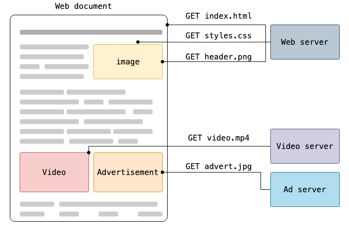

# 02_07(금)

# 오늘 목표 
1. 딥다이브 선정 주제에 대한 리서치 및 정리
2. 금주 배웠던 numpy 및 pandas 내용 리마인드
3. pytorch 사전 학습하기
4. 딥러닝 파트 다시 공부하기


---
# 딥다이브 주제 선정
1. NumPy 배열의 생성과 연산이 데이터를 어떻게 처리하는지 설명하시오.

2. HTTP 통신을 활용한 JSON 데이터 읽기와 저장이 데이터 활용의 기초가 되는 이유를 설명하시오.

3. Pandas의 누락 데이터 처리 기능이 데이터 정리에 어떤 이점을 제공하는지 설명하시오.

4. 데이터 시각화의 기본 개념과 Pandas를 활용한 시각화 방법의 종류와 각 방법의 장점을 설명하시오.

5. 데이터 병합과 피벗이 데이터 분석 과정에서 중요한 이유를 설명하시오.

6. 고급 데이터 변환 및 처리를 위한 Pandas 기능(GroupBy 등) 및 기법을 설명하시오. 

**주제 : HTTP 통신을 활용한 JSON 데이터 읽기와 저장이 데이터 활용의 기초가 되는 이유를 설명하시오.**

- HTTP란?
  - HyperText Transfer Protocol : **웹에서** 데이터를 주고 받기 위한 **프로토콜** -> `웹사이트에 접속할때 브라우저와 서버 간에 정보를 주고받는 방식`
  - `실제 웹에서 이루어지는 모든 데이터 교환의 기반`이되는 Client-Server 프로토콜
      - 프로토콜이란? 컴퓨터나 네트워크 장치들이 서로 통신할 때 따르는 약속(규칙) -> `기계끼리 소통하는 언어 규칙`
    - 컴퓨터끼리 데이터를 각자 제멋대로 주고받으면 오류가 발생할 수 있음. 따라서 모두가 같은 방식으로 통신하도록 정해놓은 것이 프로토콜이다. 
  - 예시
    


- JSON이란?
  - `JavaScript 객체 문법을 따르는 문자 기반 데이터 포맷으로, 사람이 읽기 쉽고 시스템에서 구문 분석할 수 있도록 설계된 텍스트 기반 형식`
  - python의 딕셔너리와 유사한 key-value 형식
  - 예시
     ```{"name": "Jane Smith","age": 35,"city": "San Francisco","phone": "014158889275","email": "janesmith@sample.com"}```
      'name', 'age', 'city', 'phone' 'email' - key
      Jane Smith', '35', 'San Francisco', '014158889275' 및 'janesmith@sample.com' - value
  - JSON의 dtype
    - 객체 : {} 사이에 삽입된 한 쌍의 값 
      - 키는 `반드시` 문자열이어야하며, 쉼표로 구분되고, 고유 값이어야 함. 
    - 배열 : []안의 `순서`가 지정된 값의 모음 
      - 문자열, Boolean, Null, 숫자 등이 있으며 서로 다른 데이터 타입을 하나의 배열 내에 포함할수 있음

- 웹에 데이터를 저장하고 전송할 수 있는 주요 형식 
  - JSON 
  - XML : 복잡한 데이터 구조를 허용하는 JSON과 유사한 범용 마크업 언어
  - HTML :  웹 페이지의 구조 및 콘텐츠를 생성하는 데 사용되는 언어

- HTTP 통신을 활용한 JSON 데이터 읽기와 저장이 데이터 활용의 기초가 되는 이유는?

- 왜 HTTP 통신을 활용?
  1. 웹의 표준 통신 프로토콜이다. 
    - 웹 어플리케이션이 데이터를 주고 받는 기본 통신 방법이다. 
  2. 독립적인 프로토콜이다. 
    - 어떤 운영체제나 프로그래밍 언어에서 사용할 수 있다. 
  3. 가벼우면서 빠른 데이터 전손이 가능하다.
    - TCP 기반의 경량 프로토콜로 빠르게 데이터를 주고 받을 수 있게 한다. 
  4. 다양한 네트워크 환경에 최적화되어 있다.

- 왜 JSON인가? 
   
  1. JSON은 가볍고 빠르다.
     - 데이터를 표현할 때 불필요한 요소를 최소화하여 데이터 크기가 작고 처리 속도가 빠르다.

  2. JSON은 가독성이 뛰어나다.
     - key-value으로 이뤄져있기 때문에 직관적이다.
     - 텍스트 기반의 형식이며 태그로 표현하기 보다는 {} 등을 사용하여 데이터를 나열하기 때문에 태그로 이뤄진 XML보다 가독성이 뛰어나다. 

  3. JSON은 언어 독립적이다.
     - JSON은 언어 독립적인 데이터 형식이므로 다양한 프로그래밍언어(JavaScript, Python, Node.js, PHP등)에서 쉽게 활용할 수 있다.
     - 따라서, 서로 다른 언어를 사용하는 시스템 간에도 JSON을 통해 데이터를 쉽게 주고 받을 수 있다. 

  4. JSON은 복잡한 데이터 구조를 표현할 수 있다. 
     - JSON은 객체, 배열, 중첩을 지원하여 계층적인 데이터를 쉽게 다룰 수 있게 한다.

  5. JSON은 API 및 데이터 베이스 연동에 최적화되어있다. 
     - MongoDB와 같은 NoSQL 데이터베이스와 MySQL와 같은 RDBMS 둘다 JSON파일을 지원한다.
     - 또한 다양한 웹 API, 모바일 앱, 클라우드 서비스 등에서 표준적인 데이터 형식으로 많이 활용된다.

- 따라서?
  - HTTP 통신을 활용한 JSON 데이터의 읽기와 저장은 속도, 범용성, 효율성 측면에서 뛰어난 장점을 제공하기때문에 현대 데이터 활용의 표준이 되고 있다. 
 

참고자료 : 
https://developer.mozilla.org/en-US/docs/Web/HTTP/Overview
https://www.oracle.com/kr/database/what-is-json/
https://velog.io/@akfls221/HTTP%EC%9D%98-%ED%86%B5%EC%8B%A0%EB%B0%A9%EC%8B%9D%EA%B3%BC-%EA%B5%AC%EC%84%B1


---
# 금일 회고

__-
