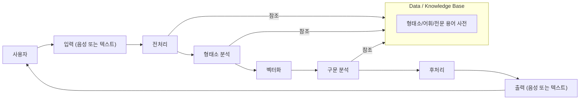

#인공지능 #강의 #NLP

# 강의
## NLP
인간의 언어 현상을 컴퓨터와 같은 기계를 이용해서 묘사할 수 있도록 연구하고 이를 구현하는 인공지능의 분야 중 하나 


BoW(Bag of Words)
- 문서 내 단어의 등장 빈도수를 벡터로 표현하는 방법 
- 각 문서에 포함된 단어들의 순서나 문법은 무시하고, 단어들이 얼마나 자주 등장했는지만 고려함
https://wikidocs.net/22650

TF-IDF(Tem Frequency-Inverse Document Frequency) 
- 단어의 빈도와 해당 단어가 다른 문서에 등장하는 빈도(IDF)를 결합해 단어의 중요도를 측정하는 방법 
https://wikidocs.net/24559

Multinomial Naive Bayes
- 각 특징(예: 단어)의 빈도에 기반해 카테고리를 예측하는 확률적 분류 알고리즘 

Embedding layer 
- 단어를 벡터화하는 것

| 개념 / 기술                          | 설명                                                                   |
| -------------------------------- | -------------------------------------------------------------------- |
| 토큰화 (Tokenization)               | 텍스트를 단어, 문장 등의 단위로 나누는 과정, 이후의 언어 분석 작업을 위한 기초                       |
| 품사 태깅 (Part-of-Speech Tagging)   | 각 단어에 대해 품사를 태그하는 작업, 문장의 문법적 구조를 이해하는 데 중요                          |
| 의존 구문 분석 (Dependency Parsing)    | 문장의 문법적 구조를 분석하여 단어들 간의 의존 관계를 파악하는 기술                               |
| 단어 임베딩 (Word Embedding)          | 단어를 벡터 형태로 변환하여 단어 간의 의미적 유사성을 수치화, Word2Vec, GloVe, FastText 등이 대표적 |
| 시퀀스 투 시퀀스 (Sequence-to-Sequence) | 입력 시퀀스를 다른 시퀀스로 변환하는 모델, 기계 번역, 텍스트 요약 등에 사용                         |
| Transformer 모델                   | 병렬 처리가 가능하고 장기 의존성을 효과적으로 학습할 수 있는 모델 구조, BERT, GPT, T5 등이 대표적       |

| 연구/동향                         | 설명                                                                     |
| ----------------------------- | ---------------------------------------------------------------------- |
| 사전 학습 모델 (Pre-trained Models) | 대량의 텍스트 데이터로 사전 학습된 모델을 다양한 NLP 작업에 활용, BERT, GPT-3 등이 대표적             |
| Few-shot Learning             | 소량의 데이터로도 모델이 새로운 작업을 학습할 수 있도록 하는 기술, 데이터 수집이 어려운 작업에 유용              |
| 멀티모달 학습 (Multimodal Learning) | 텍스트뿐만 아니라 이미지, 음성 등 다양한 형태의 데이터를 동시에 처리하는 기술, Vision-Language 모델 등이 있음 |
| 공정성과 편향 (Fairness and Bias)   | NLP 모델의 공정성과 편향 문제를 다루는 연구, 모델이 특정 그룹에 대해 편향된 결과를 내지 않도록 함             |

## RNN
- 어느 한 지점에서 시작한 것이, 시간을 지나 다시 원래 장소로 돌아오는 것, 그리고 이 과정을 반복하는 것이 바로 '순환'
- 순환하는 경로가 존재해야 데이터가 같은 장소를 반복하여 왕래할 수 있는데 RNN은 이러한 순환하는 경로가 있다. 
- 이 순환 경로를 따라 데이터는 끊임없이 순환할 수 있으며 순환되기 때문에 과거의 정보를 기억하는 동시에 최신 데이터로 갱신될 수 있음. 
![[Pasted image 20250310110523.png]]
- RNN계층은 순환하는 경로를 포함하며 이 순환 경로를 따라 데이터를 계층 안에서 순환시킬 수 있음.
- 출력이 2개로 분기하고 있음을 알 수 있습니다. 여기서 말하는 '분기'란 같은 것이 복제되어 분기함을 의미합니다. 그리고 이렇게 분기된 출력 중 하나가 자기 자신에 입력되죠(즉.순환합니다)
이러한 rnn 계층을 펼치면 다음과 같은 형태가 됩니다. 
![[Pasted image 20250310110615.png]]
- 즉, 하나는 **다음 타임스텝($h_{t}$​)으로 전달**되어 **순환(RNN의 특성)을 형성** 하며 다른 하나는 **최종 출력층으로 전달**될 수도 있음.
- 이를 수식으로 표현하면 다음과 같다. 
- ![[Pasted image 20250310113418.png]]
$$h_{t} = f(W_{h}h_{t-1} + W_{x}x_{t} + b)$$
	$x_t$ : 현재 입력
	$h_t$ : 현재 은닉 상태
	$h_{t-1}$ : 이전 은닉 상태
	$W_h,W_x$ : 학습 가능한 가중치 행렬(하나는 x를 출력 h로 변환하기 위한 가중치 $W_x$이고 다른 하나는 1개의 RNN 출력을 다음 타임스텝의 출력으로 변환하기 위한 가중치 $W_h$)
	b : 바이어스
	f : 활성화 함수 (ReLU, tanh 등)
- 일반적인 피드포워드 신경망 구조와 유사하지만, 다수의 RNN 계충 모두가 실제로는 '같은 계층'인 것이 지금까지의 신경망과는 다름. 
```python
class RNN:
	def __init__(self,Wx,Wh,b):
		self.params = [Wx,Wh,b]
		self.grads = [np.zeros_like(Wx), np.zeros_like(Wh), np.zeros_like(b)]
		self.cache = None

	def forward(self, x, h_prev):
		Wx, Wh, b = self.params
		t = np.matmul(h_prew,Wh) + np.matmul(x, Wx) + b
		h_next = np.tanh(t)

		self.cache = (x, h_prev, h_next)
		return h_next
```
- 해당 코드를 그림으로 나타내면 다음과 같음 
![[Pasted image 20250310113807.png]]


BPTT
![[Pasted image 20250310111403.png]]
- RNN의 오차역전파법을 적용할 수 있다. 저 순전파를 수행하고, 이어서 역전파를 수행하여 원하는 기울기를 구할 수 있습니다. 여기서의 오차역전과법은 '시간 방향'으로 펼친 신경망의 오차역전파법이란 뜻으로 BPTT(Back propagation Through Time)라고 함
- 하지만 긴 시계열 데이터를 학습할때는 문제가 됨. 왜냐하면 길 수록 컴퓨팅 비용이 증가할 수 도 있으며 vanishing gradient 문제가 발생. 
- 따라서, 적당한 길이로 끊는 것을 일반적. 시간축 방향으로 너무 길어진 신경망을 적당한 지점에서 잘라내어서 작은 신경망 여러개로 만든다는 아이디어. 이를 Truncated BPTT라고 함. 
- 여기서 중요한 것은 순전파의 연결은 유지한채로 역전파의 연결만 끊는 것.
- ![[Pasted image 20250310111730.png]]
- 이처럼 역전파의 연결을 잘라버리면, 그보다 미래의 데이터에 대해서는 생각할 필요가 없어집니다. 따라서 각각의 블록 단위로, 미래의 블록과는 독립적으로 오차역전파법을 완결시킬 수 있음.
- **반드시 기억할 점은 역전파의 연결은 끊어지지만, 순전파의 연결은 끊어지지않는다**는 점 
![[Pasted image 20250310111900.png]]
![[Pasted image 20250310111937.png]]
![[Pasted image 20250310112008.png]]
- 이런 식으 로 순전파의 연결을 유지하면서 블록 단위로 오차역전파법을 적용할 수 있음

```python 
def backward(self, dh_next):
	Wx, Wh, b = self.params
	# 순전파에서 사용된 가중치 (Wx, Wh)와 편향 (b)이 저장
	x, h_prev, h_next = self.cache
	# `self.cache`에는 **순전파에서 저장한 값들** (`x_t`, `h_{t-1}`, `h_t`)이 저장

	dt = dh_next * (1- h_next ** 2)
	db = np.sum(dt, axis = 0)
	dWh = np.matmul(h_prev.T, dt)
	dh_prev = np.matmul(dt, Wh.T)
	dWx = np.matmul(x.T, dt)
	dx = np.matmul(dt, Wx.T)

	self.grads[0][...] = dWx
	self.grads[1][...] = dWh
	self.grads[2][...] = db

	return dx, dh_prev
```
- 해당 코드를 그림으로 표현하면 다음과 같음.
![[Pasted image 20250310114109.png]]
- 각각의 수식을 표현하면 다음과 같다. 


RNN의 미니배치 학습
- 이를 미니 배치를 통해 학습을 하려면 다음과 같은 그림이 된다. 
- RNN계층의 입력 데이터로, 첫 번째 미니배치(샘플 데이터) 때는 처음부터 순서대로 데이터 를 제공합니다. 그리고 두 번째 미니배치 때는 500번째의 데이터를 시작 위치로 정하고, 그 위 치부터 다시 순서대로 데이터를 제공하는 것입니다(즉, 시작 위치를 500만큼 '옮겨줍니다).
![[Pasted image 20250310113015.png]]
- 첫번째 미니배치 원소는 $x_0..x_9$ 가 되고, 두 번째 미니배치 원소는 $x_{500},..x_{509}$ 가 됩니다. 그리고 이 미니배치 데이터를 RNN의 입력 데이터로 사용해 학습을 수행합니다. 
- 이후로는 순서대로 진행되므로 다음에 넘길 데이터는 각각시계열 데이터의 10~19번째 데이터와 510~519번째의 데이터가 되는 식이죠. 이처럼 미니배치 학습을 수행할 때는 각 미니배치의 시작 위치를 오프셋으로 옮겨준 후 순서대로 제공하면 됩니다. 또한 데이터를 순서대 로 입력하다가 끝에 도달하면 다시 처음부터 입력하도록 합니다.
- 구체적으로는 '데이터를 순서대로 제공하기'와 '미니배치별로 데이 터를 제공하는 시작 위치를 옮기기'입니다


https://wikidocs.net/22886
https://wikidocs.net/46496

### LSTM


https://wikidocs.net/22888


---
# 보충 공부

### 확률 분포


### 나이브 베이즈 
앞선 절에서 우리는 베이즈 정리(식 4.15)를 활용하여 LDA와 QDA 분류기를 개발하였다. 이번 절에서는 베이즈 정리를 이용하여 널리 사용되는 나이브 베이즈 분류기를 소개한다.

베이즈 정리는 사후 확률인 $p_k(x) = Pr(Y = k | X = x)$를 사전 확률 $π_1, ..., π_K$와 클래스 조건부 확률밀도함수 $f_1(x), ..., f_K(x)$를 이용하여 표현하는 공식이다. 이를 실제로 사용하려면 $π_1, ..., π_K$와 $f_1(x), ..., f_K(x)$를 추정해야 한다. 앞서 살펴본 것처럼, 사전 확률 $π_1, ..., π_K$를 추정하는 것은 비교적 간단하다. 예를 들어, 각 클래스의 사전 확률 $\hat{π}_k$는 훈련 데이터에서 k번째 클래스에 속한 관측치의 비율로 추정하면 된다.

하지만  $f_1(x), ..., f_K(x)$를 추정하는 것은 훨씬 더 복잡하다. $f_k(x)$는 k번째 클래스에 속한 관측치의 p차원 확률밀도함수이다. 일반적으로 p차원 밀도함수를 추정하는 일은 매우 어렵다. LDA에서는 매우 강력한 가정을 통해 이를 간소화했는데, 각 클래스의 밀도함수가 클래스별 평균$μ_k$와 클래스 공통 공분산행렬 $Σ$을 가지는 다변량 정규분포라는 가정을 했다. QDA의 경우에는 클래스별 평균 $μ_k$와 클래스별 공분산행렬 $Σ_k$를 가지는 다변량 정규분포를 가정했다. 이러한 강한 가정 덕분에 p차원의 밀도함수를 추정하는 문제를 훨씬 간단한 문제로 전환할 수 있었다.

나이브 베이즈 분류기는 $f_1(x), ..., f_K(x)$를 추정할 때 다른 접근 방식을 사용한다. 특정한 분포(예: 다변량 정규분포)에 속한다고 가정하지 않고, 대신 다음과 같은 단 하나의 가정을 한다:

**각 클래스 내부에서 p개의 예측변수는 서로 독립적이다.** 

수식으로 표현하면, $k = 1, ..., K$에 대해
$$f_k(x) = f_{k1}(x_1) × f_{k2}(x_2) × ··· × f_{kp}(x_p)$$
로 나타낼 수 있다. 여기서 $f_{kj}$는 $k$번째 클래스에서 $j$번째 예측변수의 밀도함수이다.

이 가정이 강력한 이유는 무엇일까? 
p차원 밀도함수를 추정하기가 어려운 이유는 개별 예측변수의 주변분포(marginal distribution)뿐 아니라 예측변수 간의 결합분포(joint distribution)까지 고려해야 하기 때문이다. 
다변량 정규분포의 경우, 예측변수 간의 결합분포는 공분산행렬의 비대각(off-diagonal) 원소들에 의해 요약된다. 하지만 일반적인 상황에서는 예측변수 간의 결합분포를 파악하는 일이 매우 어려우며, 추정 또한 굉장히 까다롭다. 
**그러나 나이브 베이즈에서는 각 클래스 내에서 예측변수들이 독립적이라고 가정함으로써, 예측변수 간의 결합분포를 고려할 필요가 완전히 사라지게 된다.**

그렇다면 p개의 예측변수가 정말로 클래스 내에서 독립적이라는 가정을 실제로 믿을 수 있을까? 
대부분의 경우, 그렇지 않다. 그러나 이 가정은 모델링의 편의를 위해 이루어진 것으로, 특히 관측치 수(n)가 예측변수 수(p)에 비해 충분히 크지 않아 결합분포를 정확히 추정하기 어려운 상황에서 매우 좋은 결과를 낳는 경우가 많다. 
기본적으로 나이브 베이즈의 독립성 가정은 어느 정도 편향(bias)을 도입하지만, 분산(variance)을 줄여서 편향-분산 트레이드오프에 의해 실제로 좋은 성능을 보이는 분류기를 만들어낸다.

나이브 베이즈 가정을 도입하면 $f_k(x) = f_{k1}(x_1) × f_{k2}(x_2) × ··· × f_{kp}(x_p)$를 $\operatorname{Pr}(Y=k \mid X=x)=\frac{\pi_k f_k(x)}{\sum_{l=1}^K \pi_l f_l(x)}$에 대입하여 사후 확률을 다음과 같이 표현할 수 있다.

$$\operatorname{Pr}(Y=k \mid X=x)=\frac{\pi_k \times f_{k 1}\left(x_1\right) \times f_{k 2}\left(x_2\right) \times \cdots \times f_{k p}\left(x_p\right)}{\sum_{l=1}^K \pi_l \times f_{l 1}\left(x_1\right) \times f_{l 2}\left(x_2\right) \times \cdots \times f_{l p}\left(x_p\right)}$$

각 예측변수의 밀도함수 $f_{kj}$를 훈련 데이터 $x_{1j}...x_{nj}$를 이용해 추정할 때는 다음과 같은 방법들이 있다.

 - $X_j$가 정량적이라면, $X_j|Y =k ∼ N(μ_{jk}, {σ_{jk}}^2)$라고 가정할 수 있습니다. 즉, 각 클래스 내에서 j번째 예측 변수가 (단변량) 정규 분포에서 도출된다고 가정합니다. 이것은 QDA와 비슷하게 들릴 수 있지만, 여기서는 예측자가 독립적이라고 가정한다는 점에서 한 가지 중요한 차이점이 있습니다. 클래스별 공분산 행렬이 대각선이라는 추가 가정이 있는 QDA와 같습니다. 
 
 - $X_j$가 양적인 경우, 또 다른 옵션은 $f_{kj}$에 대해 비모수적 추정치를 사용하는 것입니다. 이를 수행하는 매우 간단한 방법은 각 클래스 내에서 j번째 예측자의 관측값에 대한 히스토그램을 만드는 것입니다. 그런 다음 k번째 클래스에 있는 훈련 관찰자 중 $x_j$와 동일한 히스토그램 구간에 속하는 관찰자의 비율로 $f_{kj}(x_j)$를 추정할 수 있습니다. 또는 본질적으로 히스토그램의 평활화된 버전인 커널 밀도 추정기를 사용할 수도 있습니다.

- Xj가 정성적인 경우, 각 클래스에 해당하는 j번째 예측자에 대한 훈련 관찰의 비율을 간단히 계산할 수 있습니다. 예를 들어, $X_j$ ∈ {1, 2, 3}이고 k번째 클래스에 100개의 관측값이 있다고 가정합니다. 그 중 32개, 55개, 13개의 관측값에서 j번째 예측자가 각각 1, 2, 3의 값을 갖는다고 가정합니다. 그러면 $f_{kj}$를 다음과 같이 추정할 수 있습니다.
- $$\hat{f}_{k j}\left(x_j\right)= \begin{cases}0.32 & \text { if } x_j=1 \\ 0.55 & \text { if } x_j=2 \\ 0.13 & \text { if } x_j=3\end{cases}$$


이제 p = 3이고 K = 2 클래스인 장난감 예제에서 나이브 베이즈 분류기를 고려해 보겠습니다.
예측자와 K = 2 클래스로 구성된 장난감 예제를 살펴보겠습니다. 처음 두 예측자는 정량적 예측자입니다,
세 번째 예측자는 세 가지 수준의 정성적 예측자입니다. 추가로 가정합니다.
$\hat{\pi}_{1}$ = $\hat{\pi}_{2}$ = 0.5라고 가정합니다. k = 1,2와 j = 1,2,3에 대한 예상 밀도 함수 $\hat{f}$는 다음과 같습니다.
![[Pasted image 20250310103342.png]]

이제 새로운 관측치 $x^∗ = (0.4, 1.5, 1)^T$ 를 분류하고자 한다고 가정합니다. 

이 예에서 fˆ (0.4)=0.368,fˆ (1.5)=0.484,fˆ (1)=0.226,그리고fˆ (0.4)= 11 12 13 21
0.030,fˆ (1.5)=0.130,fˆ (1)=0.616.이 추정치를 (4.30) 22 23에 꽂으면
에 넣으면 Pr(Y = 1|X = x∗) = 0.944 및 Pr(Y = 2|X = x∗) = 0.056의 사후 확률 추정치가 도출됩니다.

표 4.8은 기본 데이터 세트에 나이브 베이즈 분류기를 적용한 결과의 혼동 행렬을 보여주는데, 여기서 기본값의 사후 확률, 즉 P(Y = 기본값|X = x)가 0.5가 되면 기본값을 예측합니다. 이를 표 4.4의 LDA 결과와 비교하면 결과가 엇갈립니다. LDA는 전체 오류율이 약간 낮지만, 나이브 베이즈는 실제 불이행자 중 더 많은 비율을 정확하게 예측합니다. 이 나이브 베이즈 구현에서는 각 정량적 예측 변수가 가우스 분포에서 도출된다고 가정했습니다(물론 각 클래스 내에서 각 예측 변수는 독립적이라고 가정했습니다).

LDA와 마찬가지로 기본값 예측을 위한 확률 임계값을 쉽게 조정할 수 있습니다. 예를 들어, 표 4.9는 P(Y = default|X = x)가 0.2 이상인 경우 불이행을 예측할 때 발생하는 혼동 행렬을 보여줍니다. 다시 말하지만, 결과는 임계값이 동일한 LDA와 비교하여 혼합됩니다(표 4.5). 나이브 베이즈는 오류율이 더 높지만 실제 기본값의 거의 3분의 2를 정확하게 예측합니다.

이 예에서 나이브 베이즈가 LDA보다 성능이 뛰어나지 않은 것은 그리 놀라운 일이 아닙니다. 이 데이터 세트는 n = 10,000, p = 2이므로 나이브 베이즈 가정으로 인한 분산 감소가 반드시 가치 있는 것은 아닙니다. p가 더 크거나 n이 더 작은 경우, 즉 분산 감소가 매우 중요한 경우에는 LDA 또는 QDA에 비해 나이브 베이즈를 사용하는 것이 더 큰 이득을 볼 것으로 예상됩니다.
### iid
iid : Independent and identically distribution : 독립 항등 분포
이는 random variable이 위 영어 그대로 **independent 독립적**이고, **identically distribution 같은 확률 분포**를 가지면 iid하다고 정의합니다.
1) independent  
<span style="background:#fff88f">독립적이라는 것은 각 각의 사건이 다른 사건에 영향을 주지 않는 것을 말합니다.  </span>
ex) 주사위의 처음 시행, 두번 째 시행, ... 모두 독립적인 사건으로 서로 간 영향을 주지 않습니다.

2) identically distribution  
<span style="background:#fff88f">같은 확률분포를 가진다는 것 입니다.</span> 예를 들어 위의 예시와 같이 계속해서 주사위를 굴린다면 identically distribution을 갖지만, 주사위를 굴리고 동전을 굴린다면 이는 각 사건이 독립적이기는 하나 동일한 분포를 따르는 것이 아니기에 iid하다고 말할 수 없습니다.

![[Pasted image 20250310092026.png]]

---
보충자료
[강의](https://www.youtube.com/watch?v=3FCXtq55xvI&t=3611s)
[문서](https://wikidocs.net/60760)
