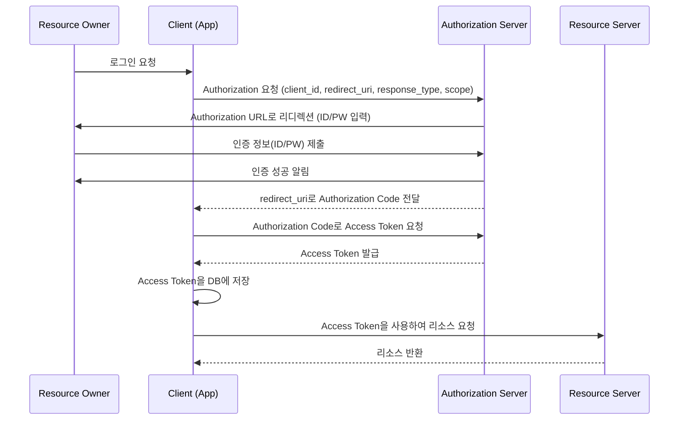

## 2. JWT(JSON Web Token)에 대해서 설명해 주세요. 
JWT는 웹 통신에서 인증과 정보 교환을 위해 사용되는 JSON 형식의 토큰 기반 인증 방식 
- 헤더 : 토큰타입, 알고리즘 정보
- 페이로드 : 토큰의 정보를 담고 있는 클레임(=JWT를 통해서 전달하고자 하는 데이터)들을 가짐
- 서명 : 
	- 헤더의 인코딩 값과 정보의 인코딩 값을 합친 후 주어진 비밀키로 해싱(=긴 데이터를 짧고 규칙적인 코드로 바꾸는 것)하여 생성 
	- 토큰의 정보가 신뢰할 수 있는 지를 확인하는 역할 
장점 : 확장성, 독립성 
단점 : 네트워크 부하의 증가

Access Token : 보호된 정보들에 대한 접근 권한 부여에 사용
Refresh Token : Access Token과 함께 사용하여 새로운 Access Token을 요청함, 더 긴 유효 기간을 지님 

## 3. OAuth에 대해서 간단히 설명해 주세요.
Open Authorization의 약자로, 웹과 애플리케이션에서 사용자 인증과 권한 부여를 위한 제3자 인증 방식의 개방형 표준 프로토콜 
Oauth를 통해서 자신의 개인 정보를 제3자 서비스에 공유하지 않고도 다른 서비스에 대한 접근 권한 부여받아 사용 가능 

작동 방식 


여기서 Resource Owner는 리소스의 소유자, Authorization Server는 Resource Owner의 인증을 담당하고 Client의 Access Token에 응답을 해주는 서버 

|역할|예시 설명|
|---|---|
|**Resource Owner (리소스 소유자)**|사용자 본인 (예: 김철수 씨)  <br>→ 김철수 씨의 페이스북 정보(이름, 이메일 등)를 소유한 사람|
|**Authorization Server (권한 서버)**|페이스북 서버  <br>→ "김철수"가 진짜 본인인지 로그인해서 인증해주고, 인증되면 Access Token을 발급해주는 서버|
|**Client (클라이언트)**|쇼핑몰 웹사이트 (예: "BuyNow 쇼핑몰")  <br>→ 페이스북을 통해 사용자 정보를 받아오려고 하는 외부 앱|
|**Resource Server (리소스 서버)**|페이스북의 리소스 API 서버  <br>→ 김철수 씨의 이름, 이메일 같은 개인정보가 저장되어 있는 서버|

1. **김철수 씨 (Resource Owner)** 가 "BuyNow 쇼핑몰"에 회원가입을 하려고 해.
2. "BuyNow 쇼핑몰" (Client)이 **페이스북 Authorization Server**에 로그인 요청을 보낸다. (client_id, redirect_uri, scope 등 포함)
3. 김철수 씨는 **페이스북 로그인 화면**(Authorization URL)으로 이동해서 자신의 페이스북 **ID/PW를 입력**한다.
4. **페이스북 Authorization Server**는 김철수 씨가 성공적으로 로그인하면, **Authorization Code**를 **redirect_uri**를 통해 쇼핑몰(Client)로 전달한다.
5. 쇼핑몰(Client)은 이 **Authorization Code**를 다시 **페이스북 Authorization Server**에 보내서 **Access Token**을 요청한다.
6. 페이스북은 Access Token을 쇼핑몰(Client)에게 발급해준다.
7. 쇼핑몰(Client)은 받은 Access Token을 **자기 DB에 저장**한다.
8. 이제 쇼핑몰은 **페이스북 Resource Server**에 Access Token을 들고 김철수 씨의 **이름, 이메일** 같은 정보를 요청해서 받아올 수 있다.

## 4. SQL Injection에 대해서 간단히 설명해 주세요 .
SQL injection은 악의적인 사용자가 SQL 쿼리를 조작하여 데이터베이스에서 비정상적인 동작을 유도하는 보안 공격 
ex)
`select * from users where username='id' and password = 'pasword'`
`select * from users where username='' or '1'='1' and password = 'pasword'`
-> 조건이 항상 참이므로 모든 사용자 정보가 반환 

이를 방지하는 방법은?
1. 사용자의 입력을 모두 검증하는 입력 검증 
2. SQL 직접 입력하지 않게 하는 PreparedStatement(=SQL 문 틀을 미리 만들어 놓고, 나중에 값만 채워서 빠르고 안전하게 실행하는 것) 사용
3. SQL Injection 방어 기능을 제공하는 ORM(=ORM은 클래스를 가지고 DB를 조작하게 해주는 기술. 빠르고 편하지만, 복잡한 쿼리에는 조심해야 한다.) 활용
```Python
# ORM없이 직접 다룸
cursor.execute("INSERT INTO users (name, age) VALUES (%s, %s)", (name, age))

# ORM을 사용 
user = User(name="Alice", age=25)
session.add(user)
session.commit()
# 객체 `user`를 만들고 저장(`add`, `commit`)하면 끝!
```

## 5. 단방향 암호화에 대해서 간단히 설명해주세요. 
복호화 불가능한 암호화로서 주로 해시 알고리즘을 이용한 암호화 방식
해시 알고리즘: 아무 길이의 데이터를 고정된 길의 특정한 값(해시값)으로 변환하는 알고리즘 
- 고정된 길이
- 빠른 계산 속도
- 작은 변화에 민감
- 충돌 회피
- 복구 불가능 : 해시값만 가지고 원래 데이터를 알아낼 수 없어야한다. 
```text
"Hello, world!" → SHA-256 → 
b94d27b9934d3e08a52e52d7da7dabfac484efe37a5380ee9088f7ace2efcde9
```

