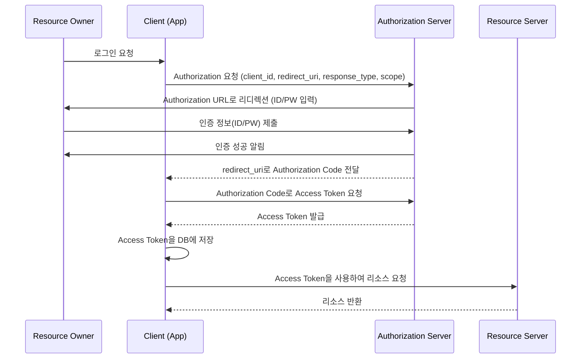
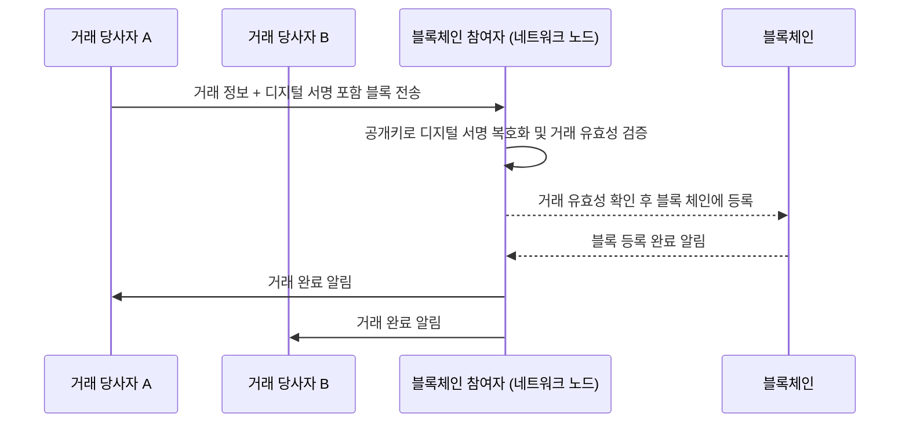

## 1. DDos 공격에 대하여 설명해 주세요.
여러 컴퓨터가 동시에 한 서버에 네트워크에 대향의 트래픽을 보내서 그 서비스를 이용하지 못하게 하는 공격방법 
## 2. JWT(JSON Web Token)에 대해서 설명해 주세요. 
JWT는 웹 통신에서 인증과 정보 교환을 위해 사용되는 JSON 형식의 토큰 기반 인증 방식 
- 헤더 : 토큰타입, 알고리즘 정보
- 페이로드 : 토큰의 정보를 담고 있는 클레임(=JWT를 통해서 전달하고자 하는 데이터)들을 가짐
- 서명 : 
	- 헤더의 인코딩 값과 정보의 인코딩 값을 합친 후 주어진 비밀키로 해싱(=긴 데이터를 짧고 규칙적인 코드로 바꾸는 것)하여 생성 
	- 토큰의 정보가 신뢰할 수 있는 지를 확인하는 역할 
장점 : 확장성, 독립성 
단점 : 네트워크 부하의 증가

Access Token : 보호된 정보들에 대한 접근 권한 부여에 사용
Refresh Token : Access Token과 함께 사용하여 새로운 Access Token을 요청함, 더 긴 유효 기간을 지님 

## 3. OAuth에 대해서 간단히 설명해 주세요.
Open Authorization의 약자로, 웹과 애플리케이션에서 사용자 인증과 권한 부여를 위한 제3자 인증 방식의 개방형 표준 프로토콜 
Oauth를 통해서 자신의 개인 정보를 제3자 서비스에 공유하지 않고도 다른 서비스에 대한 접근 권한 부여받아 사용 가능 

작동 방식 


여기서 Resource Owner는 리소스의 소유자, Authorization Server는 Resource Owner의 인증을 담당하고 Client의 Access Token에 응답을 해주는 서버 

|역할|예시 설명|
|---|---|
|**Resource Owner (리소스 소유자)**|사용자 본인 (예: 김철수 씨)  <br>→ 김철수 씨의 페이스북 정보(이름, 이메일 등)를 소유한 사람|
|**Authorization Server (권한 서버)**|페이스북 서버  <br>→ "김철수"가 진짜 본인인지 로그인해서 인증해주고, 인증되면 Access Token을 발급해주는 서버|
|**Client (클라이언트)**|쇼핑몰 웹사이트 (예: "BuyNow 쇼핑몰")  <br>→ 페이스북을 통해 사용자 정보를 받아오려고 하는 외부 앱|
|**Resource Server (리소스 서버)**|페이스북의 리소스 API 서버  <br>→ 김철수 씨의 이름, 이메일 같은 개인정보가 저장되어 있는 서버|

1. **김철수 씨 (Resource Owner)** 가 "BuyNow 쇼핑몰"에 회원가입을 하려고 해.
2. "BuyNow 쇼핑몰" (Client)이 **페이스북 Authorization Server**에 로그인 요청을 보낸다. (client_id, redirect_uri, scope 등 포함)
3. 김철수 씨는 **페이스북 로그인 화면**(Authorization URL)으로 이동해서 자신의 페이스북 **ID/PW를 입력**한다.
4. **페이스북 Authorization Server**는 김철수 씨가 성공적으로 로그인하면, **Authorization Code**를 **redirect_uri**를 통해 쇼핑몰(Client)로 전달한다.
5. 쇼핑몰(Client)은 이 **Authorization Code**를 다시 **페이스북 Authorization Server**에 보내서 **Access Token**을 요청한다.
6. 페이스북은 Access Token을 쇼핑몰(Client)에게 발급해준다.
7. 쇼핑몰(Client)은 받은 Access Token을 **자기 DB에 저장**한다.
8. 이제 쇼핑몰은 **페이스북 Resource Server**에 Access Token을 들고 김철수 씨의 **이름, 이메일** 같은 정보를 요청해서 받아올 수 있다.

## 4. SQL Injection에 대해서 간단히 설명해 주세요 .
SQL injection은 악의적인 사용자가 SQL 쿼리를 조작하여 데이터베이스에서 비정상적인 동작을 유도하는 보안 공격 
ex)
`select * from users where username='id' and password = 'pasword'`
`select * from users where username='' or '1'='1' and password = 'pasword'`
-> 조건이 항상 참이므로 모든 사용자 정보가 반환 

이를 방지하는 방법은?
1. 사용자의 입력을 모두 검증하는 입력 검증 
2. SQL 직접 입력하지 않게 하는 PreparedStatement(=SQL 문 틀을 미리 만들어 놓고, 나중에 값만 채워서 빠르고 안전하게 실행하는 것) 사용
3. SQL Injection 방어 기능을 제공하는 ORM(=ORM은 클래스를 가지고 DB를 조작하게 해주는 기술. 빠르고 편하지만, 복잡한 쿼리에는 조심해야 한다.) 활용
```Python
# ORM없이 직접 다룸
cursor.execute("INSERT INTO users (name, age) VALUES (%s, %s)", (name, age))

# ORM을 사용 
user = User(name="Alice", age=25)
session.add(user)
session.commit()
# 객체 `user`를 만들고 저장(`add`, `commit`)하면 끝!
```

## 5. 단방향 암호화에 대해서 간단히 설명해주세요. 
- 복호화 불가능한 암호화로서 주로 해시 알고리즘을 이용한 암호화 방식
- 주어진 입력에 대해 항상 동일한 출력을 생성하지만, 그 출력에서 원래의 입력으로 돌아가는 것은 계산적으로 불가능 
- 암호화에 빠른 성능, 브루트 포스에 취약함이 있기 때문에 주위해야함. 
해시 알고리즘: 아무 길이의 데이터를 고정된 길의 특정한 값(해시값)으로 변환하는 알고리즘 
- 고정된 길이
- 빠른 계산 속도
- 작은 변화에 민감
- 충돌 회피
- 복구 불가능 : 해시값만 가지고 원래 데이터를 알아낼 수 없어야한다. 
```text
"Hello, world!" → SHA-256 → 
b94d27b9934d3e08a52e52d7da7dabfac484efe37a5380ee9088f7ace2efcde9
```
- 대표적인 기술
	-  SHA, MD5, bycrypt등 
- 이것이 유출되면 레인보우 테이블 공격, 브루트 포스 등의 문제가 발생 
	- 레인보우 테이블 공격 : 해시 함수의 가능한 모두 출력과 해당 입력을 사전에 계산해 놓은 것 
- 이를 방지하기 위해서는  솔트, 키 스트레칭, 다중 요소 인증 을 사용
	- 솔트 : 원본데이터를 소금을 치는 것과 같이 추가하여 해시 함수의 입력을 변경 
	- 키 스트레칭 : 암호화 작업을 여러번해서 공격을 어렵게 
	- 다중 요소 인증 : 추가적인 인증 요소를 도입

## 5. 블록체인에 대해서 설명해 주세요. 
- 모든 참여가자 네트워크 내의 거래 내역을 공유하는 시스템 
- 서버나 중재자 없이도 데이터의 무결성과 보안을 유지 
- 블록 단위로 데이터를 저장하며 각 블록은 특정 수의 거래를 포함하고 이 블록들은 체인처럼 연결되어 있고 블록마다 이전 블록의 해시값을 포함. 
- 한번 생성된 블록은 변경할 수없으므로 데이터의 무결성을 보장 



- ==51% 공격이란? ==
	- 특정 주체가 네트워크 해싱 파워의 51% 이상을 통제하게 되는 상황 
	- 타 노드들에 비해 빠른 속도로 신규 블록을 생성하여 네트워크에 전파하기 때문에 다른 노드들의 데이터가 아닌 공격 주체가 생성한 데이터가 포함된 블록체인을 채택 

분산 원장 기술 (DLT)
- 네트워크 참여자 간에 데이터를 공유하고 동기화하는 방식 

P2P
- 네트워크의 모든 참여자가 동등한 위치에 있고, 서버나 클라이언트 역할을 구분하지 않는 분산형 네트워크 구조 

작업 증명(PoW, Proof of Work)
- 블록체인 네트워크에서 사용되는 합의 알고리즘의 하나로 어떤 거래가 발생할 경우 해당 거래가 유효한지 검증하기 위해서 네트워크 참가즏ㄹ이 새로운 블록을 생성하거나 거래 검증을 수행하는 알고리즘 

지분 증명(Pos,Proof of Stake)
- 합의 알고리즘, 컴퓨팅 파워가 아닌 사용자의 토큰 보유량 또는 지분에 따라 새로운 블록을 생성하거나 거래를 검증하는 권한을 부여 

## 7. 비대칭 암호화, 대칭키 암호화에 대해 간단히 설명 해주세요.
| 구분      | 대칭키 암호화 (Symmetric Encryption) | 비대칭키 암호화 (Asymmetric Encryption)            |
| :------ | :----------------------------- | :------------------------------------------ |
| 키 사용 방식 | 하나의 같은 키로 암호화와 복호화             | 공개키로 암호화하고, 개인키로 복호화                        |
| 연산 성능   | 빠름 (연산 성능 좋음)                  | 느림 (연산 성능 낮음)                               |
| 보안 위험   | 키가 유출되면 모두 노출되는 위험             | 개인키만 안전하게 관리하면 상대적으로 안전 -> 개인 키타입만으로 복호화 가능 |
| 키 관리    | 키를 안전하게 공유하는 것이 어려움            | 공개키는 누구나 볼 수 있어 공유가 쉬움                      |
| 사용 예시   | 파일 암호화, VPN, 대용량 데이터 암호화       | 디지털 서명, SSL/TLS 인증, 소량 데이터 암호화              |
암호화에 고려할 사항 : 보안성, 속도와 성능, 스케일링 등을 고려 
스케일링 : 백엔드 시스템이 처리할 수 있는 작업 부하(트래픽, 요청 수)를 조절하거나, 서비스의 성능과 가용성을 향상하기 위한 확장 방법 
	수평 스케일링 : 서버를 여러 대로 늘리는 것
	수직 스케일링 : 서버 한대의 성능을 높이는 것 
세션 : 웹 사이트에서 사용하는 사용자의 정보를 일정기간 동안 서버에 기록 및 보관하여 사용자를 관리하기 위한 목적으로 사요오디는 서버의 저장 공간 
	**로그인한 사용자 정보**, **장바구니 내용** 같은 걸 세션에 저장해두고 관리

- 사용자가 웹사이트에 로그인하면,
- 서버가 사용자를 구별할 수 있도록 세션 ID(랜덤한 고유 번호)를 발급해줌.
- 세션 ID를 브라우저 쿠키에 저장하거나, URL 등에 포함시킴.
- 다음 요청부터 서버는 세션 ID를 보고 "아, 이건 아까 로그인한 김철수구나!" 하고 사용자 상태를 기억함.
## 8. 정보 보안 3요소에 대해서 설명해주세요. 
기밀성 : 민감한 정보가 권한이 없는 사람들에게 접근되거나 공개되는 것을 방지하는 것을 의미하는 것
	암호화 알고리즘
무결성 : 데이터가 정당하지 않는 방법으로 수정, 삭제, 조작되는 것을 방지하여 데이터의 일관성과 정확성을 유지하는 것
	해시함수, 디지털 서명
가용성 : 사용자가 필요할 때 언제든지 정보에 접근할수 있도록 하는 것 
	서버의 부하를 여러 서버에 분산시켜 가용성을 높이는 로드 밸런싱 기술
	데이터의 손실이 있어도 백업 및 클라우드 동기화해둔 데이터를 통해 가용성을 보장하는 백업 및 복구 전략 

체크섬 
	중복 검사의 하나 
	나열된 데이터를 더해 체크섬 숫자를 얻고, 정해진 비트 수의 모듈라로 정해진 비트로 재수겅
	구해진 체크섬 값과 송신받은 체크섬 값을 비교하여 일치 -> 무셜성
디지털 서명
	사용자의 신원을 증명하는 방법 
로드 밸런싱 
	여러 대로 늘어난 서버(스케일링한 서버) 사이에 **트래픽을 골고루 나누어주는 기술**
	
| 비유       | 설명                                              |
| -------- | ----------------------------------------------- |
| 스케일링     | 서버를 10대, 20대, 100대까지 **늘리는 것**                  |
| 로드 밸런싱   | 늘어난 서버들한테 **손님을 고르게 배분하는 것**                    |
| 함께 쓰는 이유 | 서버를 늘리기만 하면 의미 없음. 트래픽을 똑같이 나눠야 시스템이 안정적으로 돌아감. |

- 사용자가 10만 명 몰려옴 → 서버를 10대까지 **수평 스케일링**.
- 사용자의 요청이 1번 서버에만 몰리면 의미 없음.
- 그래서 **로드 밸런서**가 앞에 서서
    - A 사용자는 1번 서버로,
    - B 사용자는 2번 서버로,
    - C 사용자는 3번 서버로,
    - 
    - ... 이렇게 균등하게 요청을 분산시켜줌.